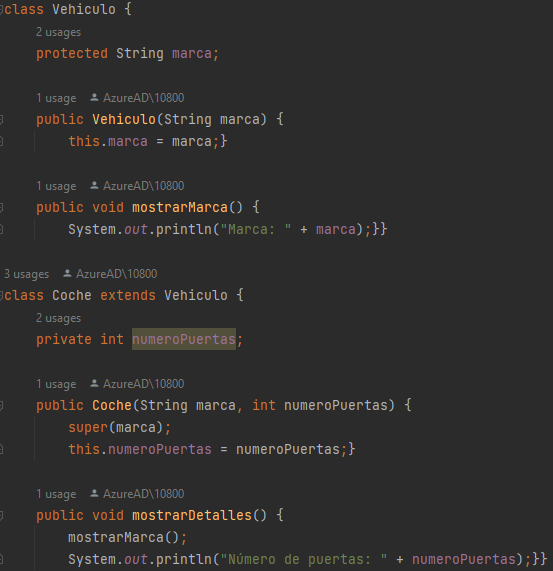
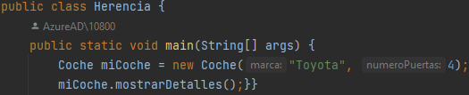
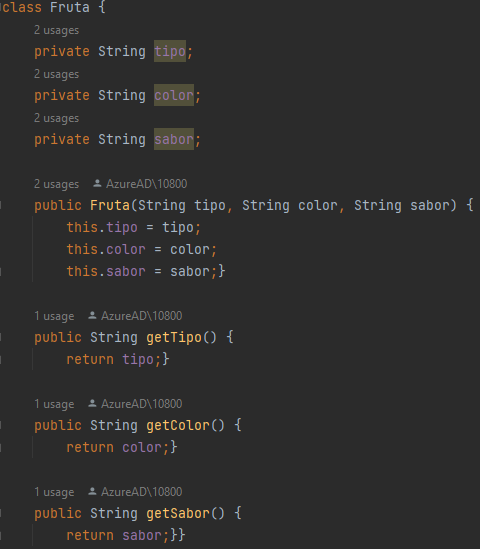
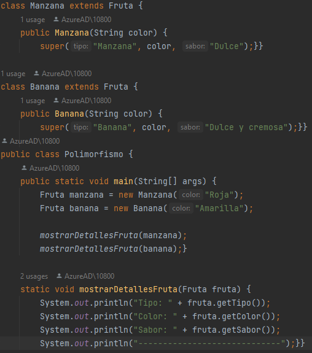

# 4 PILARES DE LA PROGRAMACIÓN ORIENTADA A OBJETOS
Integrantes: Paredes Miguel y Simba Cristian
## Abstracción
Se refiere al proceso de simplificar y representar entidades complejas mediante la identificación de características esenciales y la ocultación de los detalles irrelevantes. 
### Ejemplo
 
Se utiliza la abstracción para representar formas geométricas. La clase Forma es abstracta y contiene un método abstracto calcularArea(), lo que significa que no tiene una implementación concreta en la clase base. Luego, la clase concreta Circulo hereda de Forma y proporciona una implementación específica para el cálculo del área de un círculo.

 ## Encapsulamiento
Se refiere a la idea de ocultar los detalles internos de un objeto y proporcionar una interfaz controlada para acceder y modificar sus datos. Esto se logra mediante el uso de modificadores de acceso y métodos para interactuar con los datos de un objeto.
 ### Ejemplo
  
 
En este ejemplo, la clase Persona encapsula los datos de nombre y edad utilizando variables privadas. Los métodos getNombre() y getEdad() permiten acceder a estos datos de manera controlada desde fuera de la clase.

## Herencia
La herencia permite que una clase herede propiedades y métodos de otra clase. Permitiendo la reutilización de código y tener una jerarquía de clases.
### Ejemplo
 
 
En este ejemplo, la clase Coche hereda atributos y métodos de la clase base Vehiculo, y puede acceder a ellos para mostrar detalles específicos de un coche, como su marca y el número de puertas.

## Polimorfismo
Permite que objetos de diferentes clases sean tratados como objetos de una misma clase por medio de interfaces o métodos compartidos. Se lograrse a través de la herencia y las interfaces.
### Ejemplo
 
 
En este ejemplo, tratar como objetos a diferentes subclases como si fueran objetos de la clase base, facilitando la manipulación y el procesamiento de diferentes tipos de objetos.